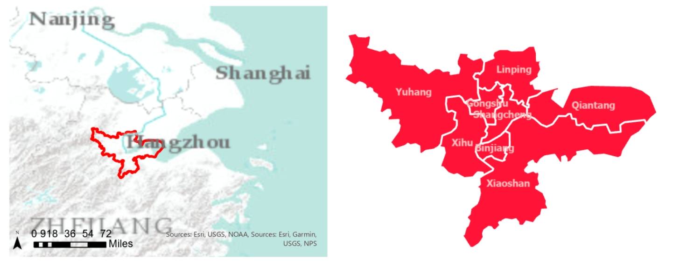
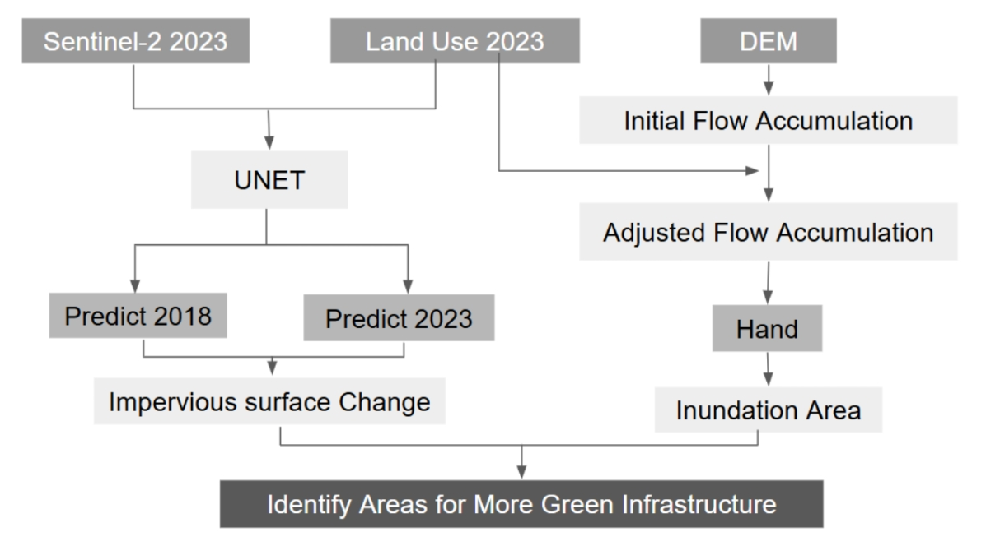
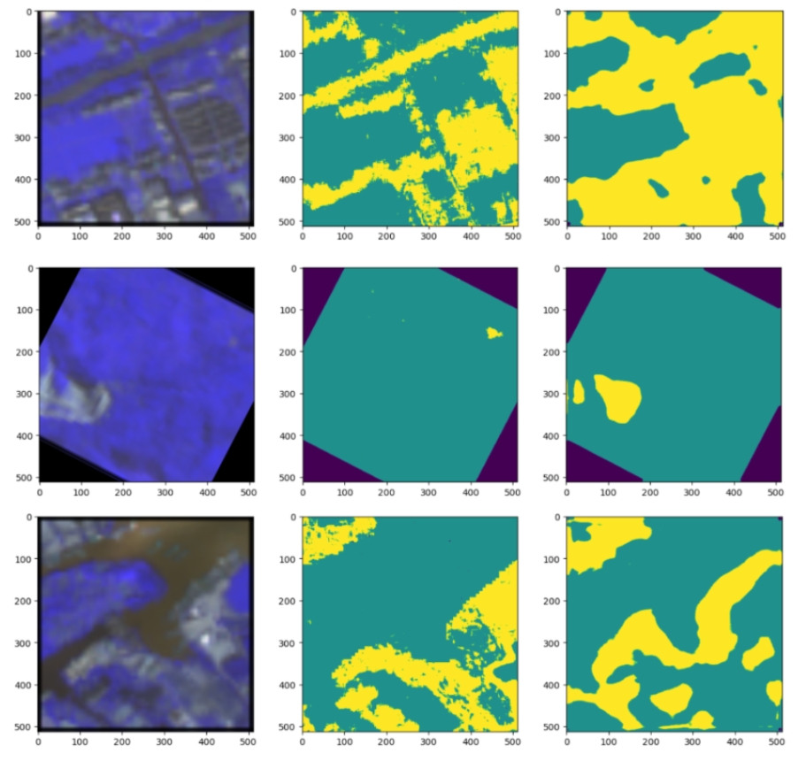
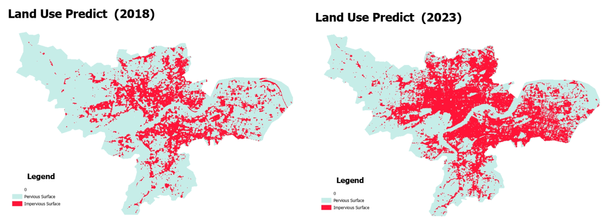
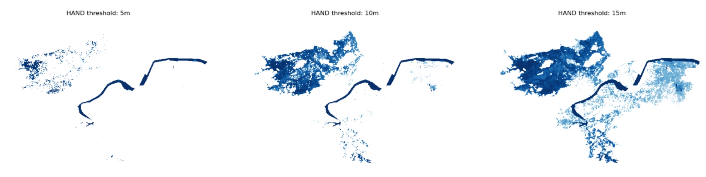
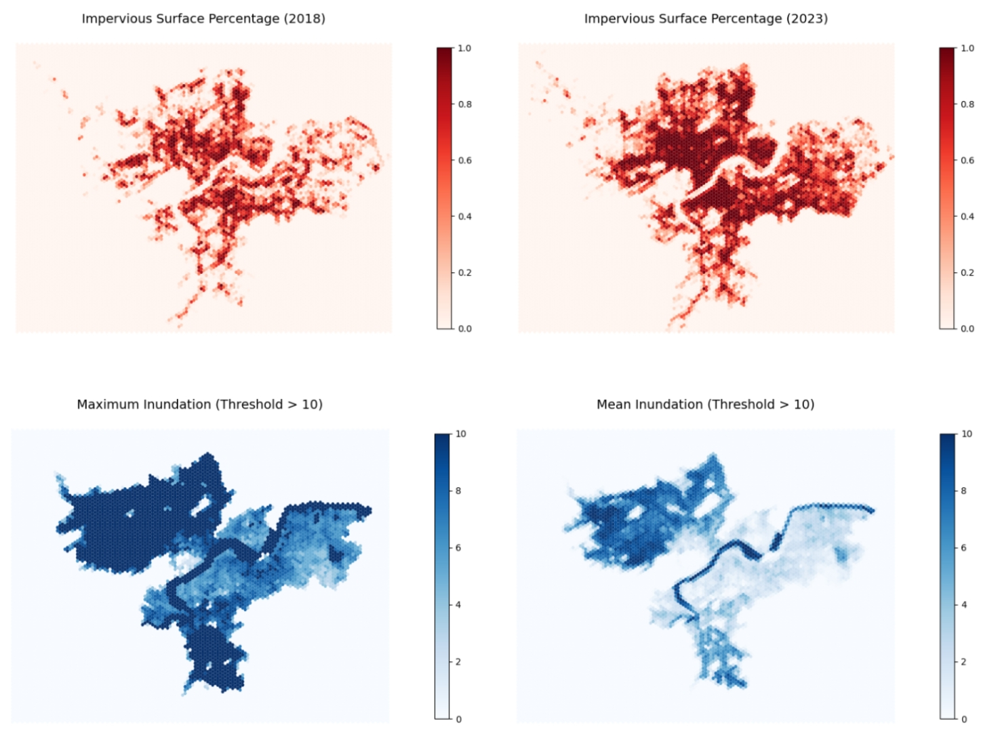
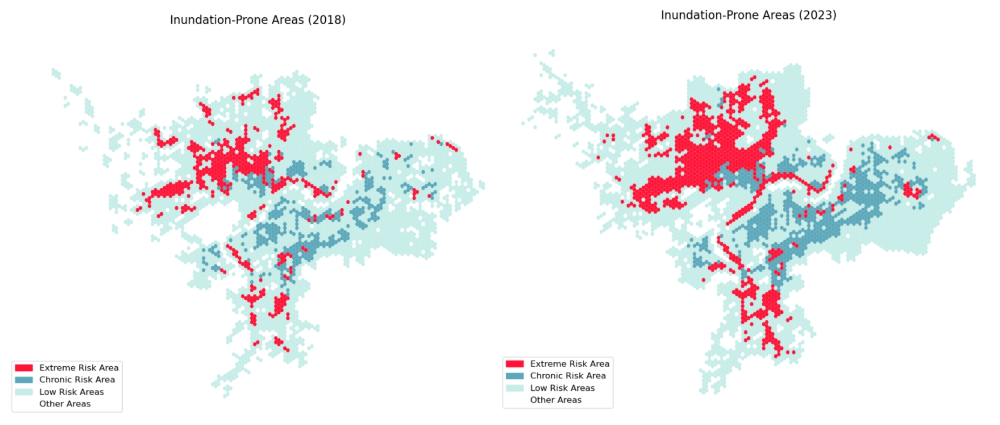
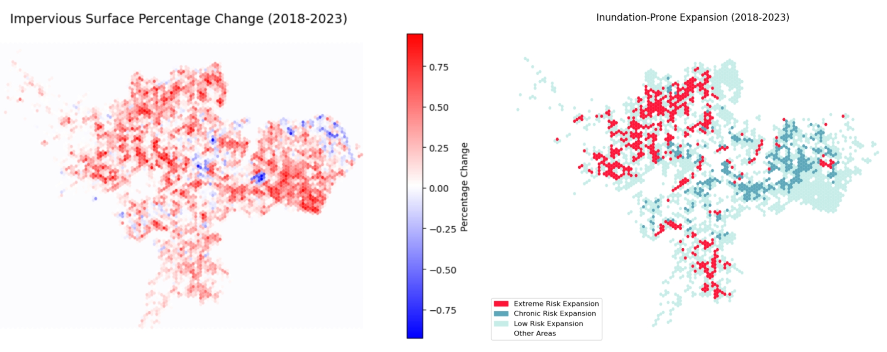

# 🌆 Assessing Urban Expansion and Inundation Risk in Hangzhou’s Central Districts
MUSA 6950: AI for Urban Sustainability - Spring 2025 - Final Project - Instructor: Xiaojiang Li

## 📖 Abstract
Urban flooding is an increasingly urgent challenge for rapidly urbanizing cities. This study proposes an integrated method that combines deep learning-based impervious surface extraction with terrain-based flood modeling to assess changes in inundation risk between 2018 and 2023 in Hangzhou’s core districts. Using Sentinel-2 imagery and a HAND (Height Above Nearest Drainage) model, we identified spatial-temporal patterns of expansion and risk to support sustainable urban planning.

## 🗺️ Study Area
This study focuses on Hangzhou’s central districts: Linping, Qiantang, Yuhang, Gongshu, Shangcheng, Xihu, Binjiang, and Xiaoshan.

## ⚙️ Methodology

- [1-Download & Process Raw Data](1_Download_Process_Raw_Data.ipynb)
- [2-HAND Model](2-HAND Model.ipynb)
- [3-Model Prepare](3-Model Prepare.ipynb)
- [4-Model Prepare](3-Model Prepare.ipynb)
- [5-HAND Model](5_HAND_Model.ipynb)
- [6-Model Prepare](3-Model Prepare.ipynb)

### 1. Impervious Surface Extraction (UNet)
- Semantic segmentation with UNet model trained on SinoLC-1 dataset.
- Input bands: Sentinel-2 B03 (Green), B04 (Red), B08 (NIR), B11 (SWIR).
- Output classes: Impervious surface, pervious surface, nodata.

### 2. HAND-Based Inundation Mapping
- HAND derived from DEM using PySheds and Rasterio.
- Thresholds applied: 5m, 10m, 15m to simulate low to high flood risk areas.
- Adjusted using impervious surface and runoff coefficient assumptions.

### 3. Hexagon-Based Spatial Aggregation
- Created 150 regular hexagons to summarize spatial indicators.
- Computed impervious surface %, mean/max HAND, and change rates.
- Classified risk into three levels: Extreme, Chronic, Low.

## 📊 Results

- **Urban Expansion**: Most significant in Yuhang and Xiaoshan.
- **Flood Risk Growth**: Areas with high impervious growth also show increased inundation exposure.
- **Hotspots**: Qiantang River corridor and western suburbs show clusters of "Extreme Risk".

## 💬 Discussion

- The approach demonstrates how remote sensing and DEM data can be integrated for urban flood risk mapping.
- Green infrastructure is urgently needed in fringe districts with low HAND and high impervious cover.
- Future applications may incorporate rainfall simulation and drainage capacity.

## ✅ Conclusion

> Land-use change is a significant flood risk driver.
> The integrated approach developed here enables scalable, data-driven planning support for risk-sensitive urban development.

## 🧰 Tools & Data Used

- **Satellite Imagery**: Sentinel-2 Level-2A
- **Elevation Data**: DEM from geospatial cloud platform
- **Deep Learning**: UNet (PyTorch)
- **Geospatial Libraries**: `rasterio`, `torch`, `geopandas`, `matplotlib`, `numpy`, `pandas`

## 📦 Data Sources

- **Boundary**  
  TianDiTu. (2024). *Administrative Division Boundary Data*. TianDiTu Cloud Center.  
  [https://cloudcenter.tianditu.gov.cn/administrativeDivision](https://cloudcenter.tianditu.gov.cn/administrativeDivision)

- **Sentinel-2 (Surface Reflectance, Level-2A)**  
  European Space Agency. (2024). *Copernicus Sentinel-2 Level-2A Surface Reflectance Product*. Google Earth Engine.  
  [https://developers.google.com/earth-engine/datasets/catalog/COPERNICUS_S2_SR](https://developers.google.com/earth-engine/datasets/catalog/COPERNICUS_S2_SR)  
  - Acquisition Dates:  
    - July 15–20, 2018 (Bands: B02, B03, B04, B08, B11)  
    - October 15–20, 2023 (Bands: B02, B03, B04, B08, B11)

- **DEM (Digital Elevation Model)**  
  National Remote Sensing Center of China. (2024). *Digital Elevation Model (DEM)*. GSCloud.  
  [https://www.gscloud.cn/search](https://www.gscloud.cn/search)

- **Land Use Map (SinoLC-1)**  
  Li, Z., He, W., Cheng, M., Hu, J., An, X., Huang, Y., Yang, G., & Zhang, H. (2023).  
  *SinoLC-1: The first 1-meter resolution national-scale land-cover map of China created with the deep learning framework and open-access data (East of China)* [Data set]. Zenodo.  
  [https://doi.org/10.5281/zenodo.7709370](https://doi.org/10.5281/zenodo.7709370)

---

## 🧾 License

This project is for academic and research purposes. Please cite the data sources appropriately if used.

---

## 📌 Contact

For questions or collaboration, please contact: zhuhaoyu0508@outlook.com
